<div align="center">

<!-- Badges -->


</div>


# La Redoute Articulated Lamp Product Page

Web project inspired by a La Redoute product page, featuring an interactive **Three.js** experience to view and control an articulated wall lamp in 3D.

## Features

- Home page with product navigation.
- **"Ver tudo!"** button that redirects to the product page.
- Product page with an e-commerce style layout.
- 3D `.glb` model integrated into the product page.
- Interactive sliders to move parts of the lamp:
  - Support Joint
  - Long Arm
  - Short Arm
  - Arm To Abajur Joint
  - Abajur Joint
- Button to turn the lamp light on/off.
- Quantity selector.
- Product color and size options.
- Product description/specifications section.
- Navbar loaded dynamically.

## Demonstrations

All demonstration screenshots are stored in the `docs/` folder and linked below.

### Product page

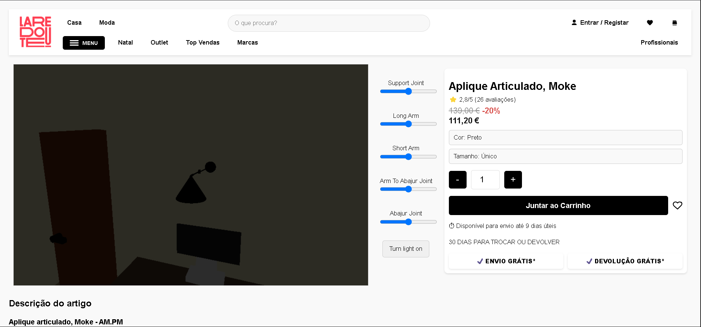

`product_page.png` shows the full product page layout: navigation bar, 3D viewer, animation sliders, product information, quantity controls, cart button and delivery/return badges.

### Product page list / product content

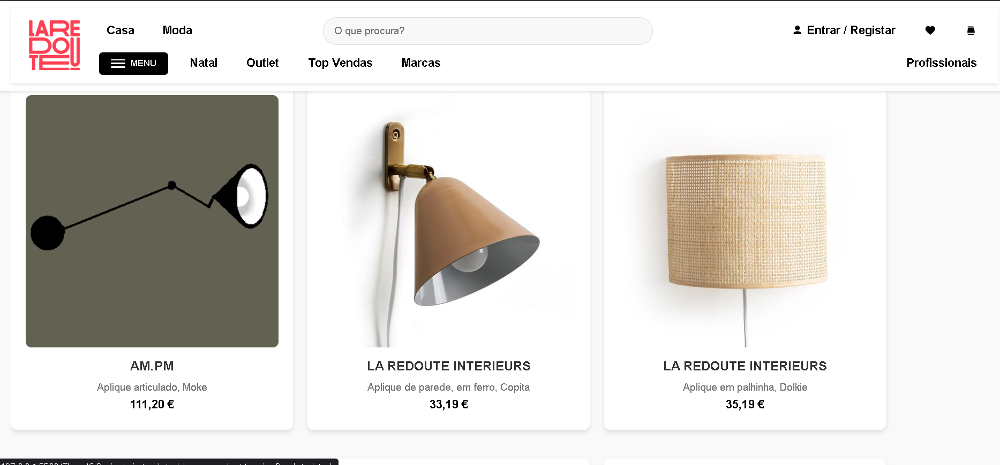

`product_page_list.png` shows the product page with the 3D section and the article description area visible below. This demonstrates how the 3D product viewer connects with the normal e-commerce content.

### Product specifications

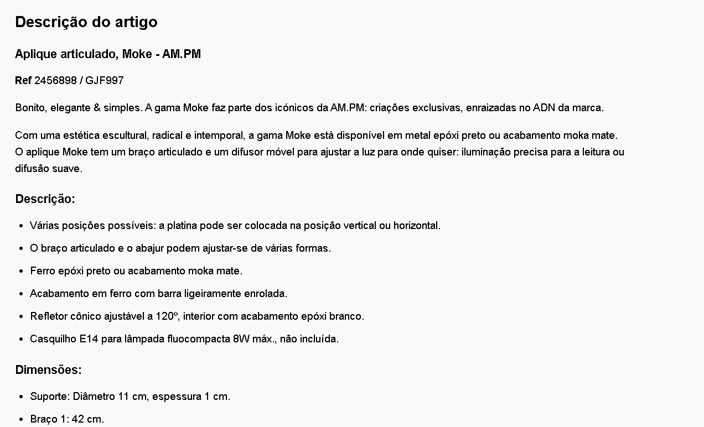

`product_specs.png` shows the detailed product description/specification section, including the product reference, written description, materials and dimensions.

### Lamp light on

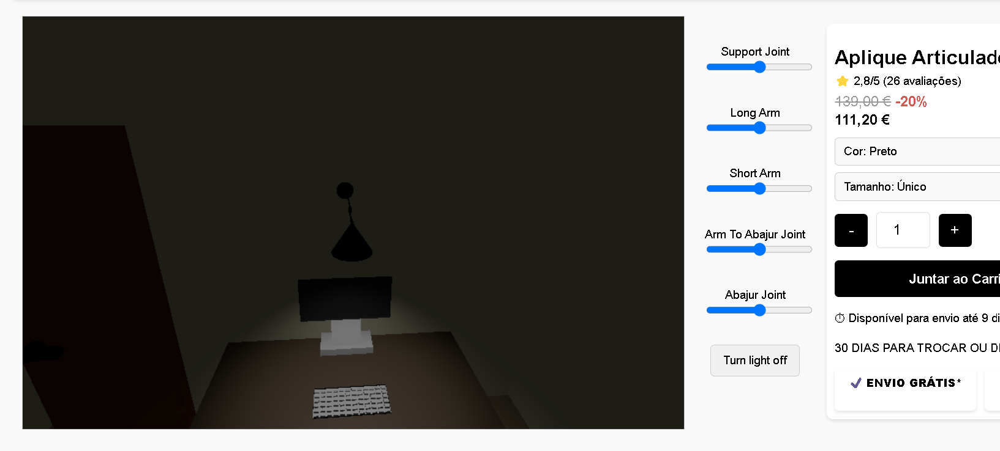

`abajour_light_on.png` demonstrates the lamp with the light enabled. The **Turn light off** button confirms that the spotlight is active and the scene is illuminated by the lamp.

### Lamp from another perspective

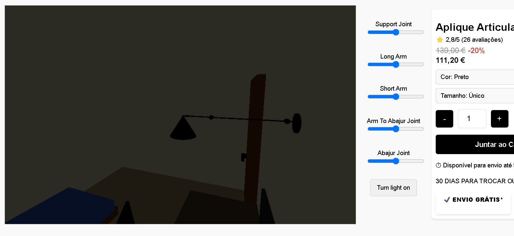

`abajur_from_other_perspective.png` shows the 3D model from a different camera angle, demonstrating that the user can inspect the product from multiple perspectives using the 3D viewer.

## Slider demonstrations

The sliders control individual parts of the articulated lamp. Each pair of screenshots shows the same lamp part in different positions.

### Support Joint

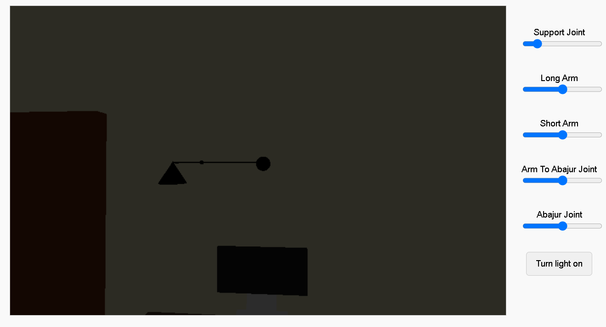
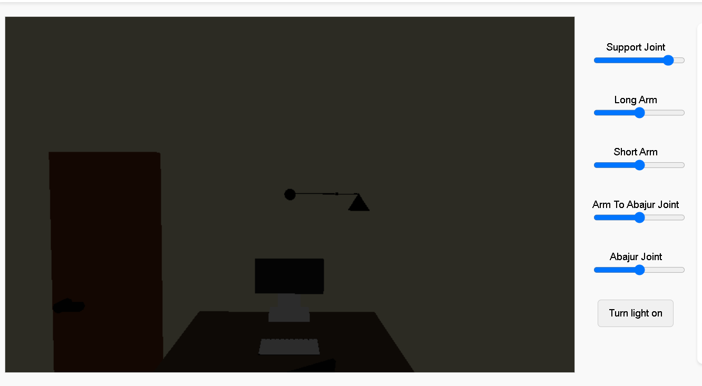

`support_joint_left.png` and `support_joint_right.png` show the **Support Joint** movement. This controls the base/wall support rotation, changing the lamp orientation from one side to the other.

### Long Arm

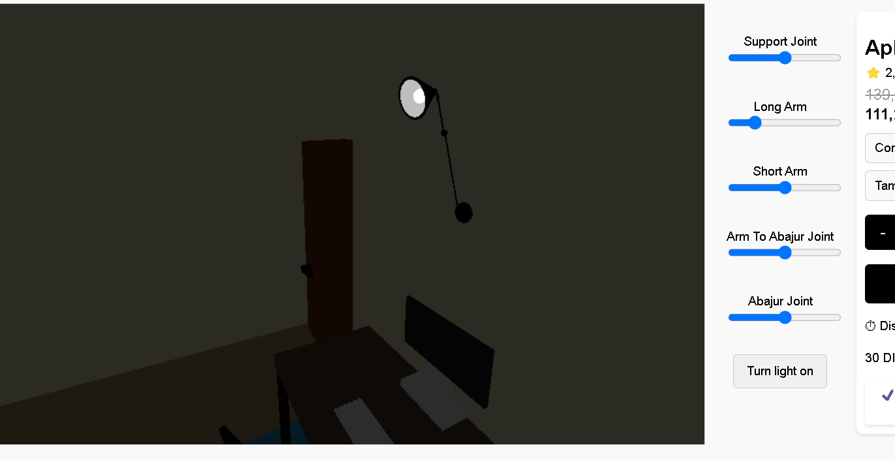
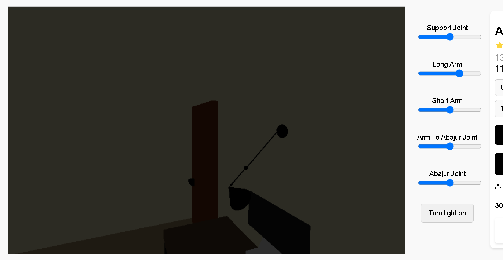

`long_arm_pt1.png` and `long_arm_pt2.png` demonstrate the **Long Arm** slider. This changes the main arm extension/angle, moving the lamp farther or closer in the scene.

### Short Arm

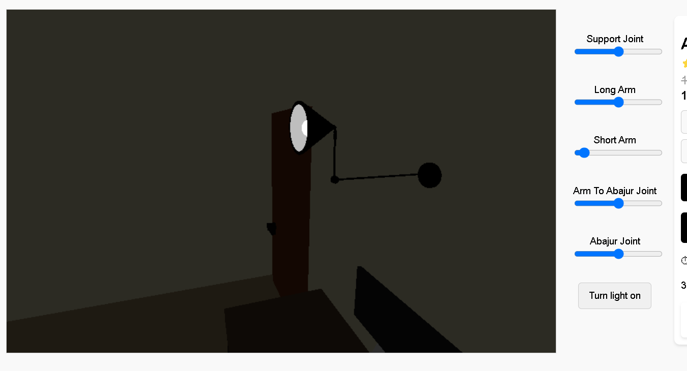
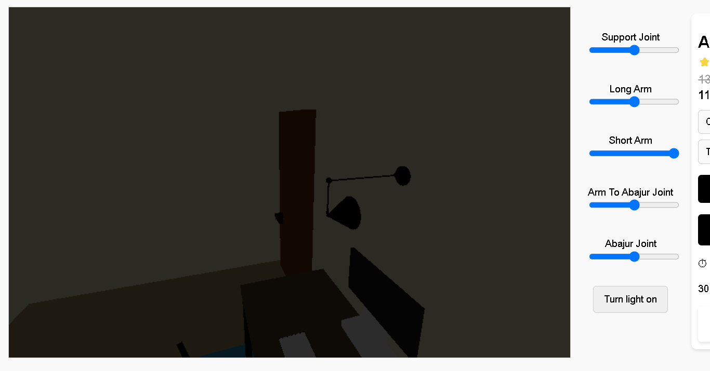

`short_arm_pt1.png` and `short_arm_pt2.png` demonstrate the **Short Arm** slider. This adjusts the smaller arm segment connected near the lamp shade.

### Arm To Abajur Joint

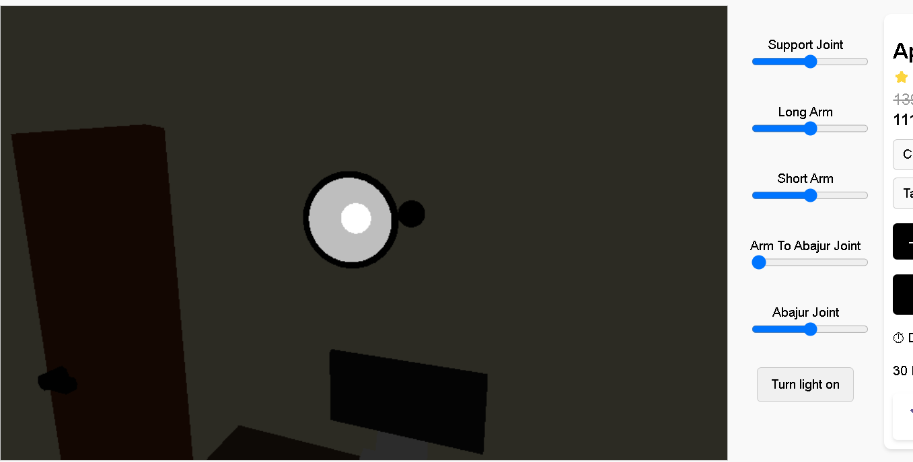
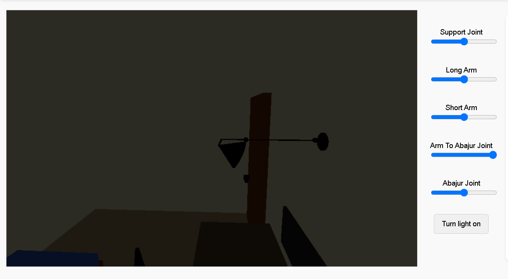

`abajur_arm_pt1.png` and `abajur_arm_pt2.png` show the **Arm To Abajur Joint** movement. This controls the joint between the lamp arm and the abajur/lamp shade.

### Abajur Joint

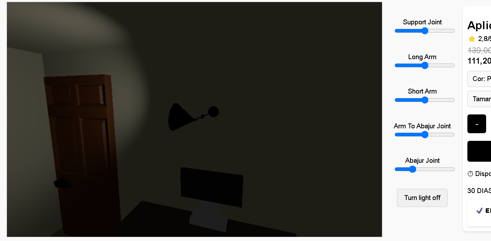
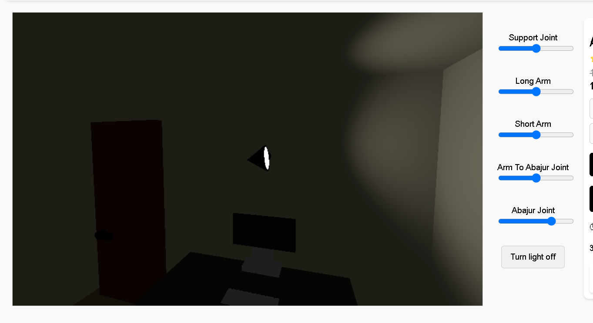

`abajur_joint_left.png` and `abajur_joint_right.png` demonstrate the **Abajur Joint** slider. This changes the angle of the lamp shade, allowing the light direction to be adjusted.

## Documentation image list

| Image | What it shows |
| --- | --- |
| `docs/product_page.png` | Complete product page with 3D viewer and product details. |
| `docs/product_page_list.png` | Product page with the description section visible below the 3D area. |
| `docs/product_specs.png` | Product description, reference, specifications and dimensions. |
| `docs/abajour_light_on.png` | Lamp spotlight turned on inside the 3D scene. |
| `docs/abajur_from_other_perspective.png` | 3D lamp viewed from another camera perspective. |
| `docs/support_joint_left.png` | Support Joint slider in one position. |
| `docs/support_joint_right.png` | Support Joint slider in the opposite position. |
| `docs/long_arm_pt1.png` | Long Arm slider demonstration, first position. |
| `docs/long_arm_pt2.png` | Long Arm slider demonstration, second position. |
| `docs/short_arm_pt1.png` | Short Arm slider demonstration, first position. |
| `docs/short_arm_pt2.png` | Short Arm slider demonstration, second position. |
| `docs/abajur_arm_pt1.png` | Arm To Abajur Joint slider demonstration, first position. |
| `docs/abajur_arm_pt2.png` | Arm To Abajur Joint slider demonstration, second position. |
| `docs/abajur_joint_left.png` | Abajur Joint slider demonstration, left position. |
| `docs/abajur_joint_right.png` | Abajur Joint slider demonstration, right position. |

## Technologies used

- **HTML5** — page structure.
- **CSS3** — styles, layout and visual presentation.
- **JavaScript ES Modules** — page logic and interaction.
- **Three.js** — 3D rendering in the browser.
- **GLTFLoader** — loading the `.glb` model.
- **OrbitControls** — camera control on the 3D canvas.
- **es-module-shims** — import map support in the browser.
- **GLB / glTF** — 3D model format for the lamp.

## Project structure

```text
laredoute-articulated-lamp-product-page/
├── README.md
├── docs/
│   ├── abajour_light_on.png
│   ├── abajur_arm_pt1.png
│   ├── abajur_arm_pt2.png
│   ├── abajur_from_other_perspective.png
│   ├── abajur_joint_left.png
│   ├── abajur_joint_right.png
│   ├── long_arm_pt1.png
│   ├── long_arm_pt2.png
│   ├── product_page.png
│   ├── product_page_list.png
│   ├── product_specs.png
│   ├── short_arm_pt1.png
│   ├── short_arm_pt2.png
│   ├── support_joint_left.png
│   └── support_joint_right.png
└── ThreeJS Projects/
    ├── node_modules/
    │   ├── es-module-shims.js
    │   └── three/
    └── articulated-lamp-product/
        ├── paginaInicial.html
        ├── paginaProduto.html
        ├── main.js
        ├── projeto_SGI_quarto.glb
        ├── navbar.html
        ├── descricao.html
        ├── apliques_parede.html
        ├── erro.html
        └── images/
```

## Main files

| File | Description |
| --- | --- |
| `paginaInicial.html` | Home page with products and a button to open the product page. |
| `paginaProduto.html` | Main product page with 3D canvas, details, price, quantity, color and actions. |
| `main.js` | Three.js code that creates the scene, camera, lights, controls, animations and loads the 3D model. |
| `projeto_SGI_quarto.glb` | 3D model used on the product page. |
| `navbar.html` | Navbar reused across pages. |
| `descricao.html` | Description content loaded on the product page. |
| `docs/` | Folder containing all README demonstration screenshots. |

## How to run

The project uses JavaScript modules, import maps and `.glb` files, so it must be served with a local server.

### Option 1: VS Code Live Server

This option requires the **Live Server** extension installed in VS Code.

1. Open VS Code.
2. Install the **Live Server** extension if it is not installed yet.
3. Open the `ThreeJS Projects` folder in VS Code.
4. Start Live Server.
5. Access:

```text
http://127.0.0.1:5500/articulated-lamp-product/paginaInicial.html
```

or directly:

```text
http://127.0.0.1:5500/articulated-lamp-product/paginaProduto.html
```

### Option 2: local server with npm

In the `ThreeJS Projects` folder, run:

```bash
npx serve .
```

Then open the address shown in the terminal and go to:

```text
/articulated-lamp-product/paginaInicial.html
```

## How the 3D works

The `main.js` file creates a Three.js scene and loads the `projeto_SGI_quarto.glb` model with `GLTFLoader`.

Once loaded, the project finds animations inside the 3D model and binds each animation to a slider in the interface. This lets the user control different parts of the articulated lamp directly in the browser.

The lamp light is simulated with a `SpotLight`. The **Turn light on / Turn light off** button changes the light intensity, creating a simple interactive lighting effect on the product page.

## Project goal

The goal is to demonstrate how an interactive 3D product can be integrated into an e-commerce page, letting the user view and manipulate the lamp directly in the browser before simulating a purchase.
