# La Redoute Articulated Lamp Product Page

Web project inspired by a La Redoute product page, featuring an interactive **Three.js** experience to view and control an articulated wall lamp in 3D.

## Features

- Home page with a hero image and product cards.
- **"Ver tudo!"** button that redirects to the product page.
- Product page with an e-commerce style layout.
- 3D `.glb` model integrated into the product page.
- Slider controls to animate parts of the lamp:
  - Support Joint
  - Long Arm
  - Short Arm
  - Arm To Abajur Joint
  - Abajur Joint
- Button to turn the lamp light on/off.
- Quantity control.
- Color selection modal.
- Navbar loaded dynamically.
- Description section loaded dynamically.

## Visual demo

### Home page

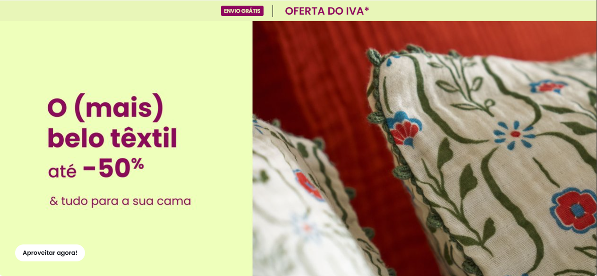

### Featured products

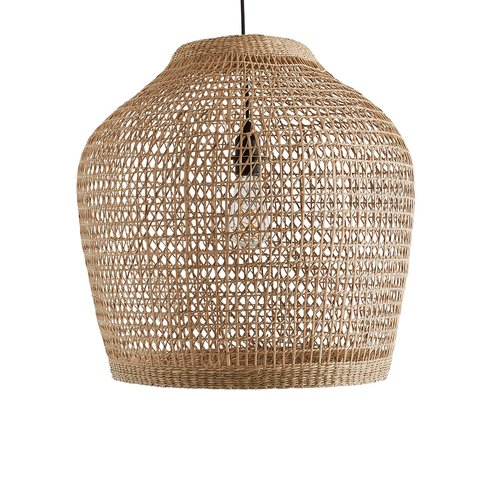
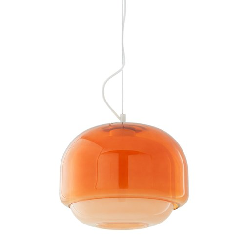
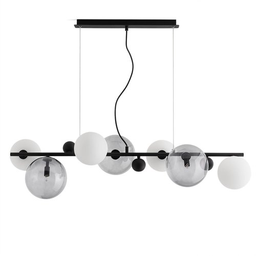

### Brand identity

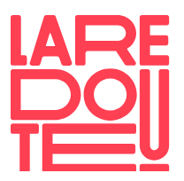

## Image documentation

All project images were copied to the `docs/images/` folder so the README can display and explain them directly.

| Image | Preview | Purpose |
| --- | --- | --- |
| `img_pag_princ.png` |  | Main promotional banner used on the home page. |
| `laredoute_logo.png` |  | La Redoute logo used as the website icon/brand identity. |
| `abajur_teto.jpg` |  | Product card image for the Makita ceiling lamp. |
| `abajur_laranja.jpg` |  | Product card image for the Kinoko orange glass lamp. |
| `abajur_bolinhas.jpg` |  | Product card image for the Bullesco smoked glass lamp. |
| `38efdca23c97b5bdba60a0f6b86ac77c.jpg` | 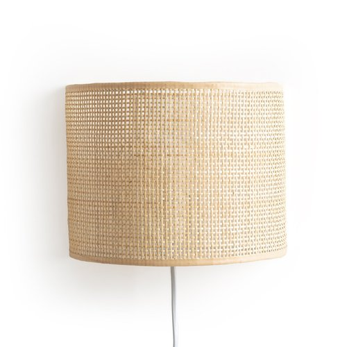 | Lifestyle photo showing a wall light in a decorated room environment. |
| `5e15f349b9d0d3b969aa9cd0edc429e6.jpg` | 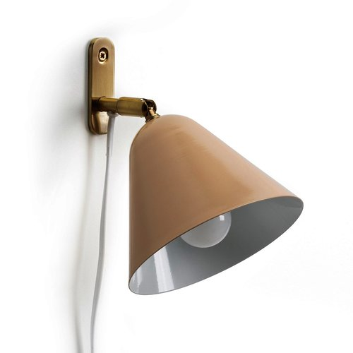 | Side-view image/illustration of the articulated lamp shape. |
| `d4259011eaea00158b7ff162e43ae2fc.jpg` | 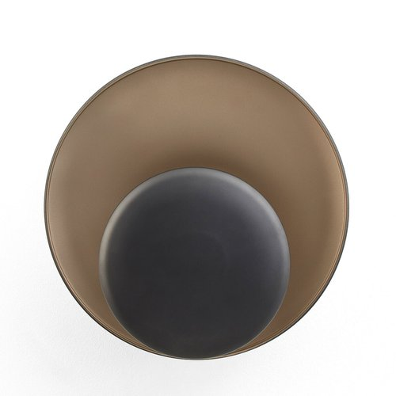 | Close-up product image of a round wall light. |
| `d74e54fff39f6f6a1218da9ca07217f7.jpg` | 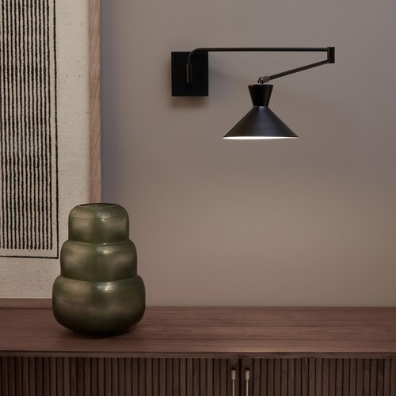 | Decorative product image used for visual variety in the shop content. |
| `f22fcfc91430d8a113bd92f3a1603620.jpg` | 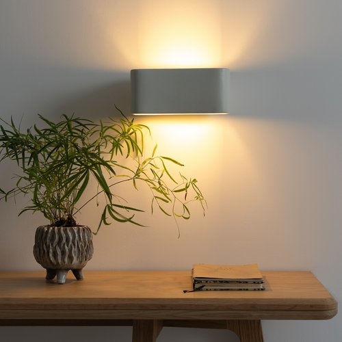 | Product photo of a brown wall lamp/applique. |
| `hnfghg398h4th4397gh949htg.jpg` | 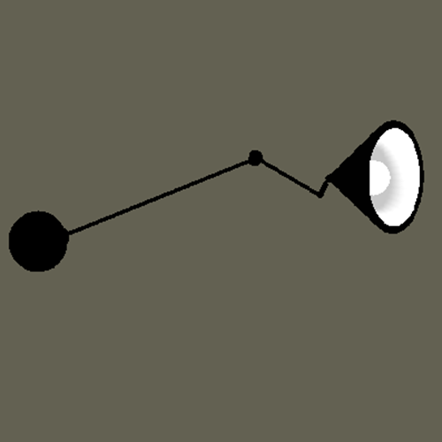 | Lifestyle image of the black articulated wall lamp, matching the main product style. |
| `arvore_natal_pag_inicial.png` | 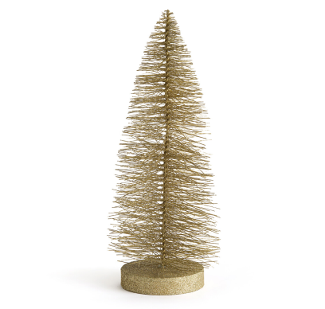 | Additional decorative image used by the project assets. |

## Technologies used

- **HTML5** — page structure.
- **CSS3** — styles, layout and visual presentation.
- **JavaScript ES Modules** — page logic and interaction.
- **Three.js** — 3D rendering in the browser.
- **GLTFLoader** — loading the `.glb` model.
- **OrbitControls** — camera control on the 3D canvas.
- **es-module-shims** — import map support in the browser.
- **GLB / glTF** — 3D model format for the lamp.

## Project structure

```text
laredoute-articulated-lamp-product-page/
├── README.md
├── docs/
│   └── images/
│       ├── 38efdca23c97b5bdba60a0f6b86ac77c.jpg
│       ├── 5e15f349b9d0d3b969aa9cd0edc429e6.jpg
│       ├── abajur_bolinhas.jpg
│       ├── abajur_laranja.jpg
│       ├── abajur_teto.jpg
│       ├── arvore_natal_pag_inicial.png
│       ├── d4259011eaea00158b7ff162e43ae2fc.jpg
│       ├── d74e54fff39f6f6a1218da9ca07217f7.jpg
│       ├── f22fcfc91430d8a113bd92f3a1603620.jpg
│       ├── hnfghg398h4th4397gh949htg.jpg
│       ├── img_pag_princ.png
│       └── laredoute_logo.png
    └── ...
```
└── ThreeJS Projects/
    ├── node_modules/
    │   ├── es-module-shims.js
    │   └── three/
    └── articulated-lamp-product/
        ├── paginaInicial.html
        ├── paginaProduto.html
        ├── main.js
        ├── projeto_SGI_quarto.glb
        ├── navbar.html
        ├── descricao.html
        ├── apliques_parede.html
        ├── erro.html
        └── images/
            ├── img_pag_princ.png
            ├── laredoute_logo.png
            ├── abajur_teto.jpg
            ├── abajur_laranja.jpg
            └── abajur_bolinhas.jpg
```

## Main files

| File | Description |
| --- | --- |
| `paginaInicial.html` | Home page with hero image, products and a button to open the product page. |
| `paginaProduto.html` | Main product page with 3D canvas, details, price, quantity, color and actions. |
| `main.js` | Three.js code that creates the scene, camera, lights, controls, animations and loads the 3D model. |
| `projeto_SGI_quarto.glb` | 3D model used on the product page. |
| `navbar.html` | Navbar reused across pages. |
| `descricao.html` | Description content loaded on the product page. |
| `docs/images/` | Documentation folder with images used by this README. |

## How to run

The project uses JavaScript modules, import maps and `.glb` files, so it must be served with a local server.

### Option 1: VS Code Live Server

1. Open the `ThreeJS Projects` folder in VS Code.
2. Start Live Server.
3. Access:

```text
http://127.0.0.1:5500/articulated-lamp-product/paginaInicial.html
```

or directly:

```text
http://127.0.0.1:5500/articulated-lamp-product/paginaProduto.html
```

### Option 2: local server with npm

In the `ThreeJS Projects` folder, run:

```bash
npx serve .
```

Then open the address shown in the terminal and go to:

```text
/articulated-lamp-product/paginaInicial.html
```

## How the 3D works

The `main.js` file creates a Three.js scene and loads the `projeto_SGI_quarto.glb` model with `GLTFLoader`.

Once loaded, the project looks for animations inside the 3D model and binds each animation to a slider in the interface. This lets the user control different parts of the articulated lamp.

The lamp light is simulated with a `SpotLight`. The **Turn light on / Turn light off** button changes the light intensity, creating a simple interaction on the product page.

## Project goal

The goal is to demonstrate how an interactive 3D product can be integrated into an e-commerce page, letting the user view and manipulate the lamp directly in the browser before simulating a purchase.
